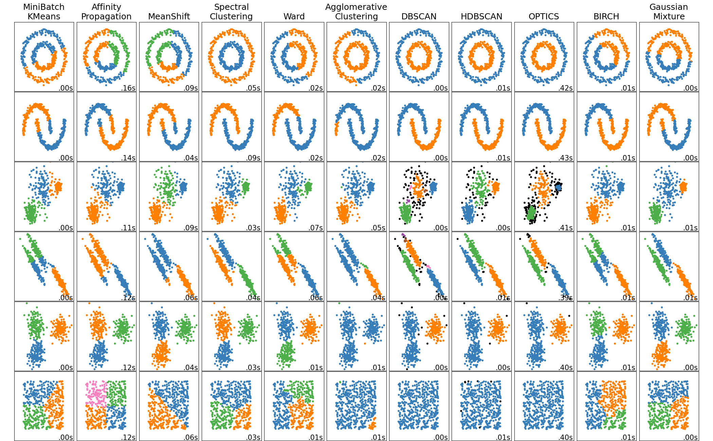
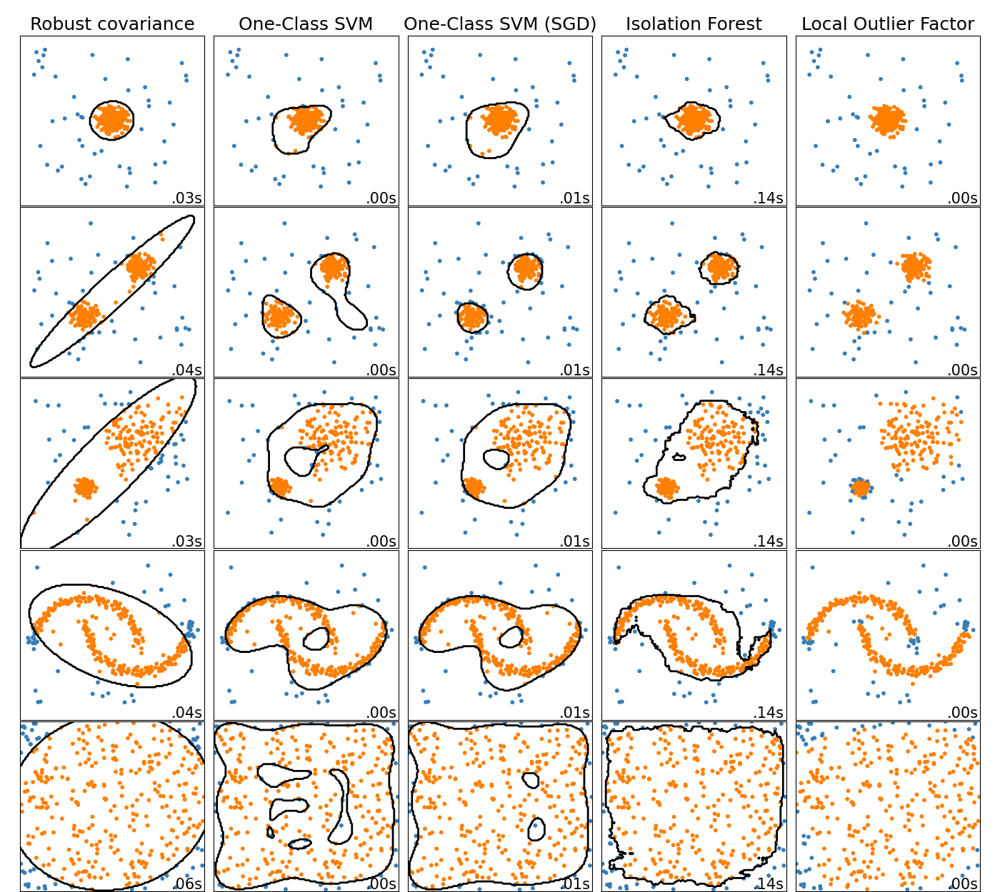

## 📌 Unsupervised Learning Models (clustering and anomaly detection)

| #  | Model                                                                                     | Type                    | Clustering Type        | Description                          | Pros                                 | Cons                                | Example Code                             | Notes                                    |
|----|--------------------------------------------------------------------------------------------|-------------------------|------------------------|--------------------------------------|--------------------------------------|-------------------------------------|------------------------------------------|------------------------------------------|
| 1  | [KMeans](#1-kmeans)                                                                       | Clustering              | Centroid-based         | Centroid-based clustering            | Simple, scalable                     | Assumes spherical clusters          | `KMeans()` (sklearn)                     | Use `k-means++` init                      |
| 2  | [MiniBatchKMeans](#2-minibatchkmeans)                                                     | Clustering              | Centroid-based         | Faster version of KMeans             | Scales to big data                   | Less accurate                       | `MiniBatchKMeans()` (sklearn)            | Use for streaming data                    |
| 3  | [Fuzzy Clustering](#3-fuzzy-clustering)                                                   | Clustering              | Fuzzy / Soft            | Points can belong to multiple clusters| Flexible for overlapping data        | Can be hard to interpret            | `skfuzzy.cmeans()` (scikit-fuzzy)        | Returns membership matrix                |
| 4  | [Gaussian Mixture Model (GMM)](#4-gaussian-mixture-model-gmm)                                      | Clustering              | Probabilistic           | Probabilistic soft clustering        | Captures overlapping clusters        | Needs to estimate #components       | `GaussianMixture()` (sklearn.mixture)    | Soft cluster assignments                  |
| 5  | [Expectation Maximization (EM)](#5-expectation-maximization-em)                          | Probabilistic Optimization| Probabilistic       | Iterative method to fit GMMs         | Soft assignments, flexible           | Can converge to local optima        | Built into `GaussianMixture()`           | Used inside GMM, HMM, etc.                |
| 6  | [DBSCAN](#6-dbscan)                                                                       | Clustering              | Density-based           | Density-based clusters               | Finds arbitrary shapes               | Bad with varying densities          | `DBSCAN()` (sklearn)                     | Doesn’t require n_clusters                |
| 7  | [OPTICS](#7-optics)                                                                       | Clustering              | Density-based           | Advanced density clustering          | Handles varying density              | More complex to interpret           | `OPTICS()` (sklearn)                     | Outputs reachability graph                |
| 8  | [HDBSCAN](#8-hdbscan)                                                                     | Clustering              | Density-based / Hierarchical | Hierarchical DBSCAN              | Very good for real-world data        | External library                    | `HDBSCAN()` (hdbscan)                    | Better than DBSCAN                        |
| 9  | [MeanShift](#9-meanshift)                                                                 | Clustering              | Density-based           | Sliding window density clustering    | No need to predefine clusters        | Very slow                           | `MeanShift()` (sklearn)                  | Good on smooth distributions              |
| 10 | [CURE](#10-cure)                                                                          | Clustering              | Hierarchical + Distance | Uses representative points & shrinking | Works well on non-spherical shapes   | Complex to implement                | Custom implementation needed             | Handles outliers better than others       |
| 11 | [Agglomerative](#11-agglomerative)                                                       | Clustering              | Hierarchical            | Bottom-up hierarchical clustering    | Simple, visualizable                 | Not scalable                        | `AgglomerativeClustering()` (sklearn)    | Use dendrogram                            |
| 12 | [Birch](#12-birch)                                                                         | Clustering              | Hierarchical            | Hierarchical clustering on large data| Efficient, scalable                  | May miss global structure           | `Birch()` (sklearn)                      | Use as pre-step                           |
| 13 | [Spectral Clustering](#13-spectral-clustering)                                             | Clustering              | Graph-based             | Graph-based method                   | Works on non-convex data             | Slow, needs full similarity matrix  | `SpectralClustering()` (sklearn)         | Good for few clusters                     |
| 14 | [Affinity Propagation](#14-affinity-propagation)                                          | Clustering              | Exemplar-based          | Exemplar-based clustering            | No need to specify clusters          | Very memory-intensive               | `AffinityPropagation()` (sklearn)        | Slow on large datasets                    |
| 15 | [Self-Organizing Maps (SOM)](#15-self-organizing-maps-som)                                | Clustering / Neural     | Neural / Topological    | Neural map preserving topology       | Good for visualization               | Requires tuning, not in sklearn     | `MiniSom` (external lib)                 | Used for 2D projection + clustering       |
| 16 | [Isolation Forest](#16-isolation-forest)                                                  | Anomaly Detection       | Tree-based              | Random splits isolate outliers       | Scalable, handles high dimensions    | Not good for small datasets         | `IsolationForest()` (sklearn)            | Good default for anomaly detection        |
| 17 | [One-Class SVM](#17-one-class-svm)                                                        | Anomaly Detection       | Boundary-based          | Learns boundary around normal class  | Effective in high-dimensions         | Sensitive to scale, slow on big data| `OneClassSVM()` (sklearn)                | Use with normalized data                  |
| 18 | [Local Outlier Factor (LOF)](#18-local-outlier-factor-lof)                                | Anomaly Detection       | Density-based           | Compares local density to neighbors  | No training phase, intuitive         | Not good for extrapolation          | `LocalOutlierFactor()` (sklearn)         | Good for local anomaly detection          |

---
## Comparison of clustering algorithms

---
## Comparison of anomaly detection algorithms

---


### 1. **KMeans**
- **Math**: Minimizes the **sum of squared distances** from each point to its cluster center.  

$$ J = \sum_{k=1}^{K} \sum_{x_i \in C_k} \|x_i - \mu_k\|^2 $$

- **Idea**: Assign each point to the nearest centroid, update centroids to be the mean of assigned points, repeat.
- **Code**:
  ```python
  from sklearn.cluster import KMeans
  model = KMeans(n_clusters=3).fit(X)
  ```
- **Use Case**: Customer segmentation, vector quantization.

---

### 2. **MiniBatchKMeans**
- **Math**: Same as KMeans, but updates centroids using small random batches of data.
- **Idea**: Trades off some accuracy for **massive speedup** and lower memory usage.
- **Code**:
  ```python
  from sklearn.cluster import MiniBatchKMeans
  model = MiniBatchKMeans(n_clusters=3).fit(X)
  ```
- **Use Case**: Real-time clustering of large streams.

---

### 3. **Fuzzy Clustering**
Also called *soft clustering* or *soft k-means*.
- **Math**: Minimizes a weighted squared error:
```math
J_m = \sum_{i=1}^{N} \sum_{j=1}^{C} u_{ij}^m \|x_i - c_j\|^2
```
where $ u_{ij} $ is the membership of point $ x_i $ in cluster $ j $, and $ m > 1 $ controls fuzziness.
- **Idea**: Each point **belongs to multiple clusters** with varying degrees of membership.
- **Code**:
  ```python
  from skfuzzy.cluster import cmeans
  cntr, u, _, _, _, _, _ = cmeans(X.T, c=3, m=2.0, error=0.005, maxiter=1000)
  ```
- **Use Case**: Market basket analysis, document clustering.

---

### 4. **Gaussian Mixture Model (GMM)**
- **Math**: Soft clusters using Gaussian distributions:
  ```math
  p(x) = \sum_{k=1}^{K} \pi_k \mathcal{N}(x \mid \mu_k, \Sigma_k)
  ```

  where $\pi_k$ is the mixing coefficient for the $k$-th component (i.e., the prior probability of choosing cluster $k$), and $\sum_k \pi_k = 1$.

- **Idea**: Assigns **probabilities** of membership to each point using Expectation-Maximization (EM).
- **Code**:
  ```python
  from sklearn.mixture import GaussianMixture
  model = GaussianMixture(n_components=3).fit(X)
  ```
- **Use Case**: Density estimation, anomaly detection.

---

### 5. **Expectation Maximization (EM)**
- **Math**: Iteratively optimizes the expected log-likelihood:
```math
\text{E-step:} \ \gamma_{ik} = \frac{\pi_k \mathcal{N}(x_i | \mu_k, \Sigma_k)}{\sum_j \pi_j \mathcal{N}(x_i | \mu_j, \Sigma_j)} \newline
\text{M-step:} \ \mu_k = \frac{\sum_i \gamma_{ik} x_i}{\sum_i \gamma_{ik}}
```

- **Idea**: Powers soft clustering in GMMs and temporal models like HMM.
- **Code**: Embedded in `GaussianMixture()` or HMM packages.
- **Use Case**: Clustering, missing data imputation.

---

### 6. **DBSCAN**
- **Math**: Density threshold:
  - A point is a core if it has ≥ `min_samples` within radius `eps`.
- **Idea**: Points with enough dense neighbors form clusters; outliers are marked as noise.
- **Note**: DBSCAN is scale-variant, i.e., if you multiply data by x2, x3, etc., the results change(https://blog.dailydoseofds.com/p/hdbscan-vs-dbscan). This is fixed in HDBSCAN.
- **Code**:
  ```python
  from sklearn.cluster import DBSCAN
  model = DBSCAN(eps=0.5, min_samples=5).fit(X)
  ```
- **Use Case**: Spatial data, fraud detection.

---

### 7. **OPTICS**
- **Math**: Orders points by reachability distance:
```math  
\text{Reachability}(p, o) = \max(\text{core\_dist}(o), \text{dist}(p, o))
```

- **Idea**: Like DBSCAN but works with **varying densities** and outputs a reachability plot.
- **Code**:
  ```python
  from sklearn.cluster import OPTICS
  model = OPTICS().fit(X)
  ```
- **Use Case**: Complex density structures, exploratory analysis.

---

### 8. **HDBSCAN**
- **Math**: Computes mutual reachability distances and builds a hierarchy.
- **Idea**: **Hierarchical version of DBSCAN** with better stability and soft cluster probability scores.
- **Code**:
  ```python
  import hdbscan
  model = hdbscan.HDBSCAN().fit(X)
  ```
- **Use Case**: High-noise real-world data like text or genomics.

---

### 9. **MeanShift**
- **Math**: Moves points to the local density maximum:
```math
x_{t+1} = \frac{\sum_{i} K(x_i - x_t) x_i}{\sum_{i} K(x_i - x_t)}
```

- **Idea**: Each point shifts toward the densest area nearby — no fixed number of clusters.
- **Code**:
  ```python
  from sklearn.cluster import MeanShift
  model = MeanShift().fit(X)
  ```
- **Use Case**: Mode seeking, image segmentation.

---

### 10. **CURE**
- **Math**: Uses multiple representative points and shrinks them toward the cluster centroid.
- **Idea**: Captures **non-spherical shapes** and handles outliers better than traditional hierarchical methods.
- **Code**: Requires custom or third-party implementation.
- **Use Case**: Geospatial and biological datasets.

---

### 11. **Agglomerative Clustering**
- **Math**: Greedily merges clusters using linkage (e.g., average, complete):
```math
\text{Linkage}(A, B) = \min_{a \in A, b \in B} \|a - b\|
```

- **Idea**: Builds a hierarchy by merging closest clusters.
- **Code**:
  ```python
  from sklearn.cluster import AgglomerativeClustering
  model = AgglomerativeClustering(n_clusters=3).fit(X)
  ```
- **Use Case**: Taxonomies, social network analysis.

---

### 12. **Birch**
- **Math**: Uses CF (Clustering Feature) trees to compactly represent data.
- **Idea**: Incrementally builds a tree, then clusters the leaf nodes.
- **Code**:
  ```python
  from sklearn.cluster import Birch
  model = Birch(n_clusters=3).fit(X)
  ```
- **Use Case**: Scalable hierarchical clustering.

---

### 13. **Spectral Clustering**
- **Math**: Uses eigenvectors of the **Laplacian matrix** of a similarity graph:
```math
L = D - A
```
  where $ D $ is the degree matrix and $ A $ is the adjacency matrix.
- **Idea**: Finds clusters by cutting a graph into parts with minimal edges between them.
- **Code**:
  ```python
  from sklearn.cluster import SpectralClustering
  model = SpectralClustering(n_clusters=3).fit(X)
  ```
- **Use Case**: Community detection, shape-based clustering.

---

### 14. **Affinity Propagation**
- **Math**: Minimizes energy using message passing between all data points.
- **Idea**: Automatically picks **exemplar points** (cluster centers) via preference and similarity.
- **Code**:
  ```python
  from sklearn.cluster import AffinityPropagation
  model = AffinityPropagation().fit(X)
  ```
- **Use Case**: Use when number of clusters is unknown.

---

### 15. **Self-Organizing Maps (SOM)**
- **Math**: Trains a grid of neurons using a neighborhood function:

$$ w_j(t+1) = w_j(t) + \alpha(t) \cdot h_{bj}(t) \cdot (x(t) - w_j(t)) $$

- **Idea**: Projects high-dimensional data onto a 2D grid, preserving topology.
- **Code**:
  ```python
  from minisom import MiniSom
  som = MiniSom(5, 5, X.shape[1])
  som.train(X, 100)
  ```
- **Use Case**: Visualization, anomaly detection in high dimensions.

---

### 16. **Isolation Forest**
- **Math**: Randomly partitions features; anomalies isolate faster (shorter average path length).
- **Idea**: Outliers are easier to isolate → fewer splits → anomaly!
- **Code**:
  ```python
  from sklearn.ensemble import IsolationForest
  model = IsolationForest().fit(X)
  ```
- **Use Case**: Credit card fraud, intrusion detection.

---

### 17. **One-Class SVM**
- **Math**: Solves:
```math
\min_{w, \rho} \frac{1}{2} \|w\|^2 \quad \text{s.t.} \quad w \cdot \phi(x_i) \geq \rho - \xi_i
```

- **Idea**: Learns a boundary around the "normal" class; anything outside is an outlier.
- **Code**:
  ```python
  from sklearn.svm import OneClassSVM
  model = OneClassSVM(kernel='rbf').fit(X)
  ```
- **Use Case**: Novelty detection with only "normal" data.

---

### 18. **Local Outlier Factor (LOF)**
- **Math**: Compares density of point to its neighbors:

```math
\text{LOF}(p) = \frac{\sum_{o \in N_k(p)} \frac{\text{lrd}(o)}{\text{lrd}(p)}}{|N_k(p)|}
```

  where lrd = local reachability density.
- **Idea**: Points that are **less dense than neighbors** are flagged as outliers.
- **Code**:
  ```python
  from sklearn.neighbors import LocalOutlierFactor
  model = LocalOutlierFactor(n_neighbors=20).fit_predict(X)
  ```
- **Use Case**: Spotting outliers in clustered regions.

---
