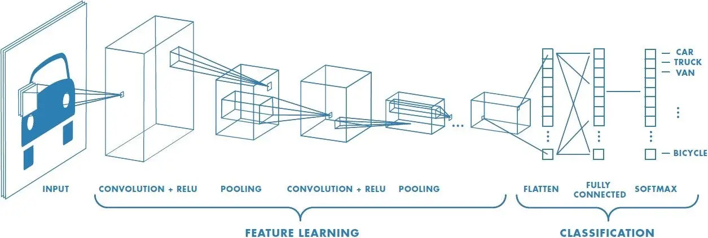
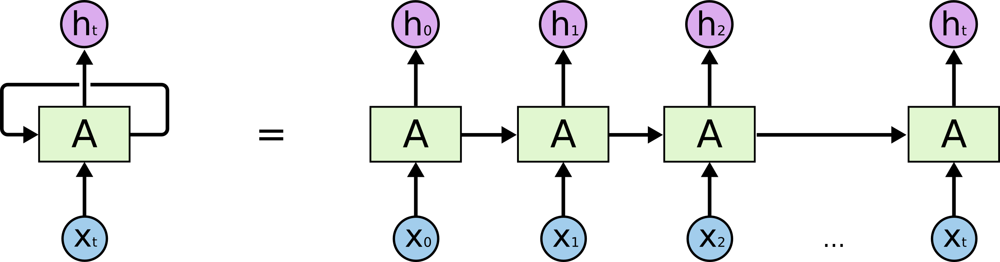
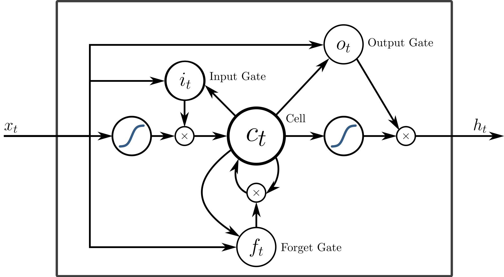
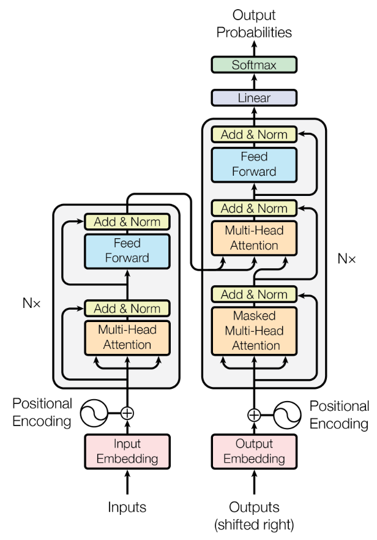

## 🧠 What is Deep Learning?

**Deep Learning (DL)** is a subfield of Machine Learning that uses multi-layered neural networks to learn representations of data. Unlike traditional ML, DL often removes the need for manual feature engineering. It learns hierarchical representations directly from raw data (e.g., pixels, sound, text).

The "deep" refers to the **depth** (i.e., number of layers) in the network.

---

## 🏗️ Core Concepts and Building Blocks

### 1. **Feed-Forward Neural Networks (FNNs)**
The simplest type of neural network. Information moves in one direction—from input to output—through layers of neurons.

- **Structure**: Input layer → Hidden layer(s) → Output layer
- Each neuron computes:  
```math
  y = \sigma(Wx + b)
```
  where $\sigma$ is an activation function (more below).

### 2. **Activation Functions**
They introduce non-linearity to the network, allowing it to learn complex patterns.

- **Sigmoid**:  
```math
  \sigma(x) = \frac{1}{1 + e^{-x}}
```
  Suffered from vanishing gradients.

- **ReLU (Rectified Linear Unit)**:  
```math
  f(x) = \max(0, x)
```
  Most common now, fast convergence.

- **Others**: Tanh, Leaky ReLU, ELU, GELU (used in Transformers)

### 3. **Backpropagation**
The algorithm for training neural networks.

- Uses **chain rule** to compute gradients of the loss function w.r.t each weight.
- Combined with **gradient descent** (or its variants like Adam) to update weights.

### 4. **Vanishing Gradient Problem**
Occurs when gradients shrink too much during backpropagation, especially in deep networks or RNNs. This leads to very slow learning in earlier layers.

---

## 🧱 Specialized Architectures

### 5. **Convolutional Neural Networks (CNNs)**
Designed for image and spatial data.

- Use **convolutional layers** instead of fully connected ones to capture **local patterns** (like edges).
- Components:  
  - **Convolution**: Feature extraction with small kernels  
  - **Pooling**: Downsampling  
  - **Fully connected**: Final classification



### 6. **Recurrent Neural Networks (RNNs)**
Designed for sequential data (e.g., time series, text).

- Maintains a **hidden state** that gets updated at each timestep:
```math
  h_t = f(Wx_t + Uh_{t-1} + b)
```
- Struggles with long sequences due to vanishing gradients.

### 7. **Long Short-Term Memory (LSTM)**
A type of RNN that handles long-term dependencies.

- Introduces **gates**: input, forget, and output gates that control information flow.
- Better at remembering context over long sequences.
- Designed to solve the vanishing gradient problem, though now transformers do the same.

---
### 8. **Gated Recurrent Unit (GRU)**  
A simplified variant of LSTM with fewer gates and parameters.

- Combines the **forget** and **input** gates into a single **update gate**.
- Also has a **reset gate** to control how much past information to forget.
- Often performs comparably to LSTM but is computationally lighter.
- GRUs maintain a balance between performance and efficiency.

## 🧪 Regularization and Training Tricks

### 9. **Dropout**
Regularization technique to prevent overfitting.

- Randomly "drops out" (sets to zero) neurons during training.
- Forces the network to not rely on specific neurons, promoting redundancy and robustness.

---

## 🧙‍♂️ Generative and Attention-Based Models

### 10. **GANs (Generative Adversarial Networks)**
Used for data generation (e.g., images, audio).

- **Two networks**:  
  - **Generator** tries to create realistic data.  
  - **Discriminator** tries to distinguish real from fake.

- They play a **minimax game**:
```math
  \min_G \max_D V(D, G)
```

- Outcome: Generator learns to create convincing fake data.

### 11. **Attention Mechanisms**  
Attention mechanisms help models **focus on the most relevant parts of the input** when generating output. This is crucial in tasks where context matters, like translating a sentence or answering a question.

#### 💡 Key Idea  
Instead of processing each input token equally, attention allows the model to **assign more importance (weight)** to some tokens based on their relevance to the current task.

#### 🔢 The Formula (Scaled Dot-Product Attention)

```math
\text{Attention}(Q, K, V) = \text{softmax}\left(\frac{QK^T}{\sqrt{d_k}}\right) V
```

- **Q (Query)**: Represents the token we're focusing on (e.g., the current word we're generating).
- **K (Key)**: Represents tokens we are comparing the query to (e.g., all words in the input).
- **V (Value)**: Holds the actual information we want to combine, weighted by relevance.

Think of it like searching a document:
- **Query** is your search term
- **Keys** are the document keywords
- **Values** are the information you want to extract

#### ✅ How it works:

1. **Similarity Scoring**: `QK^T` calculates how similar each query is to each key.
2. **Scaling**: Divides by `sqrt(d_k)` to prevent very large values.
3. **Softmax**: Turns the scores into probabilities (attention weights).
4. **Weighted Sum**: Multiply these weights with `V` to get the attended output.

#### 🔧 Example Applications:
- Machine translation (e.g., English → French)
- Text summarization
- Image captioning
- Any Transformer-based model

#### 📊 Output:
Attention produces a context-aware vector that’s passed into further layers of the model (like a Transformer encoder or decoder).

---

### 12. **Transformers**

Transformers are deep learning architectures that rely **entirely on attention mechanisms** to model relationships in sequential data, without recurrence or convolution.

#### 🔧 Core Components:

- **Self-Attention**: Allows the model to weigh the importance of each word/token in the input sequence relative to others.
- **Positional Encoding**: Since transformers don't have recurrence, positional information is added to each token to retain order.
- **Multi-Head Attention**: Applies attention multiple times in parallel, allowing the model to attend to different types of relationships.
- **Feed-Forward Layers**: After attention, each token is passed through fully connected layers.
- **Layer Normalization** and **Residual Connections**: Help with stable and fast training.

#### 📐 Architecture (Encoder-Decoder structure):

- **Encoder**: Maps input sequence to a continuous representation.
- **Decoder**: Uses this representation to generate outputs (e.g., translated text).

#### 🔍 Example in PyTorch

```python
import torch
from torch.nn import Transformer

# Create a basic transformer model
model = Transformer(d_model=512, nhead=8, num_encoder_layers=6, num_decoder_layers=6)

# Dummy input: (sequence length, batch size, model dim)
src = torch.rand((10, 32, 512))  # Source sequence
tgt = torch.rand((20, 32, 512))  # Target sequence

out = model(src, tgt)  # Output shape: (20, 32, 512)
```

#### 📊 Output

- The final output is a tensor of shape `(target_seq_len, batch_size, d_model)`
- Usually passed through a linear layer followed by `softmax` to predict tokens.

#### 🌍 Applications

- **Natural Language Processing**: BERT, GPT, T5
- **Vision**: Vision Transformers (ViT)
- **Multimodal AI**: CLIP, DALL·E

Transformers have become the backbone of modern deep learning due to their **scalability**, **parallelism**, and **performance on long sequences**.


---

## 🎯 Summary Table

| Concept                 | Use Case / Function                    | Challenge Addressed                     |
|------------------------|----------------------------------------|------------------------------------------|
| Feed-forward NN        | General modeling                       | Basic architecture                       |
| Activation functions   | Non-linearity                          | Enables learning complex patterns        |
| Backpropagation        | Training                               | Efficient gradient calculation           |
| CNN                    | Image tasks                            | Spatial invariance                       |
| RNN                    | Sequences (text, time)                 | Temporal modeling                        |
| LSTM                   | Long sequences                         | Long-term dependencies                   |
| Dropout                | Regularization                         | Overfitting                              |
| GANs                   | Data generation                        | Creating synthetic but realistic data    |
| Attention              | NLP, Seq2Seq, Transformers             | Focus on relevant input features         |
| Vanishing gradient     | Deep networks, RNNs                    | Learning stalls in early layers          |
