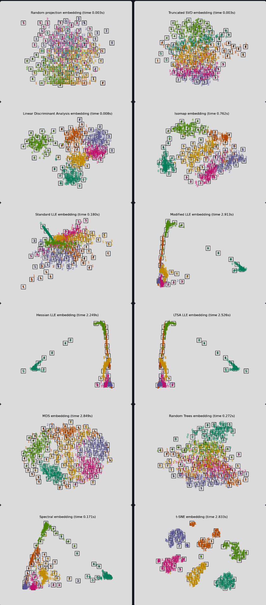
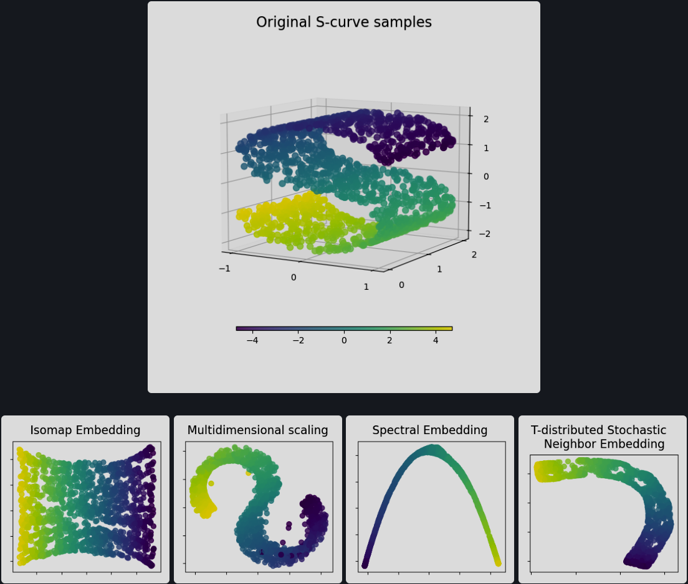

## 🔢 Dimensionality Reduction Techniques (12 total)

| #  | Method                   | Type         | Linear? | Supervised? | Preserves Structure     | Notes |
|----|--------------------------|--------------|---------|-------------|--------------------------|-------|
| 1  | **PCA**                  | Projection   | ✅       | ❌           | Global                   | Best for capturing variance |
| 2  | **Truncated SVD**        | Decomposition| ✅       | ❌           | Global                   | Great for sparse data (e.g., text) |
| 3  | **SVD**                  | Decomposition| ✅       | ❌           | Global                   | General matrix compression |
| 4  | **t-SNE**                | Manifold     | ❌       | ❌           | Local                    | Best for local structure visualization |
| 5  | **Autoencoders**         | Neural       | ❌       | ❌           | Depends (both)           | Flexible & powerful, but needs training |
| 6  | **UMAP**                 | Manifold     | ❌       | ❌ (🟡semi)   | Local + some Global      | Fast, scalable, great for visualization |
| 7  | **Isomap**               | Manifold     | ❌       | ❌           | Global                   | Captures global manifold via geodesics |
| 8  | **LLE**                  | Manifold     | ❌       | ❌           | Local                    | Good for preserving local neighborhood |
| 9  | **MDS**                  | Distance-based | 🟡linear | ❌         | Global (mostly)          | Preserves pairwise distances, useful for visualization |
| 10 | **Spectral Clustering**  | Graph        | ❌       | ❌           | Local (via Laplacian)    | More for clustering than embedding |
| 11 | **Matrix Factorization** | Latent       | 🟡semi   | ❌           | Global                   | Used in recommender systems |
| 12 | **LDA**                  | Projection   | ✅       | ✅           | Global (class separation)| Supervised dimensionality reduction |

---

---

---

## 🧭 Decision Guide: When to Use What?

| Scenario                                           | Best Methods                             |
|----------------------------------------------------|------------------------------------------|
| 🧪 **Unsupervised feature reduction (linear)**     | PCA, Truncated SVD, MDS (for distances)  |
| 🌌 **Sparse high-dimensional text data**           | Truncated SVD (LSA)                      |
| 🎨 **Visualization of non-linear manifolds**       | t-SNE, UMAP                              |
| 🧠 **Learning complex non-linear representations** | Autoencoders                             |
| 🕳️ **Detecting global manifold structure**        | Isomap, MDS                              |
| 🧩 **Understanding local neighborhood geometry**   | LLE, UMAP                                |
| 🎯 **You have labels & want better class separation** | ✅ LDA                                 |
| 🤖 **You’re building a recommender system**        | Matrix Factorization                     |

---

## 🔁 Visualization vs. Modeling

| Goal                          | Pick                                     |
|-------------------------------|------------------------------------------|
| Pure visualization (2D)       | t-SNE, UMAP, MDS                         |
| Feature reduction for models  | PCA, LDA, Autoencoders                  |
| Sparse NLP tasks              | Truncated SVD                           |
| Recommenders                  | Matrix Factorization                    |

---

## 🧠 TL;DR Cheat Sheet

- **PCA**: General-purpose, fast, interpretable
- **Truncated SVD**: Best for sparse/text data
- **SVD**: Low-rank matrix compression
- **t-SNE/UMAP**: Visualization of local structure (non-linear)
- **Autoencoders**: Deep, customizable non-linear features
- **LDA**: Supervised projection that maximizes class separation
- **Isomap**: Preserves global manifold structure using graph distances
- **LLE**: Preserves local neighborhood using linear reconstructions
- **MDS**: Preserves pairwise distances, good for visualizing structure
- **Spectral Clustering**: Graph-based technique for non-convex cluster shapes
- **Matrix Factorization**: Learns latent features, great for recommenders
