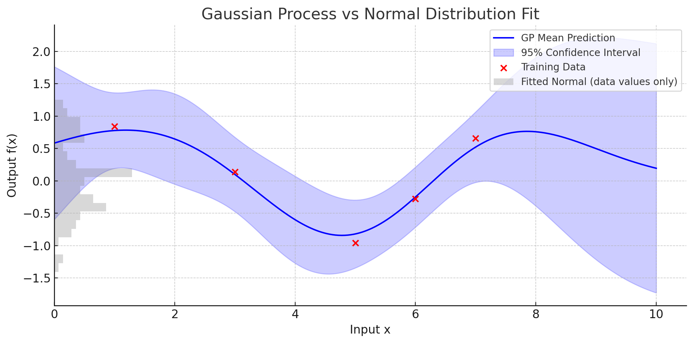

# ML Study Notes

- **Naive Bayes** is good for NLP and text classification when we have TF-IDF and good for e.g., email spam detection. It assumes independence between features.
- **SGD (Stochastic Gradient Descent)** is an optimization technique and backbone of training neural networks. If the loss function is convex, Gradient Descent is guaranteed to converge. Stochastic means update weights using a random subset of the data, instead of all the data. There are other optimizers for NNs like Adam, Momentum, LAMB, etc. 
- **Adam** (Adaptive Moment Estimation) improves on SGD by **adapting** learning rate, using momentum to **smooth noisy updates**, and works well with **sparse gradients** (e.g., NLP, embeddings, etc.).
- Sparse gradients happen due to sparse input features (NLP, recommender systems, one-hot encoding) and/or sparse layers (word2vec, transformers, regularization L1).
- **Presision** = TP / (TP + FP), **accuracy of positive predictions**
- **Recall** = TP / (TP + FN), **how well the model identifies all actual positives**
- L1 regularization (LASSO): can shrink some weights to zero (feature selection)
- L2 regularization (RIDGE): shrinks all weights but keeps them small, to make sure not one feature will dominate the others.
- **Feature scaling** is doen to ensure all features contribute equally, preventing some larger ranges from dominating. This helps models converge faster and perform better. Tree-based models like DT and RF don't require feature scaling. Also when using SVMs w/ non-linear kernels, scaling isn't as crucial as in linear models. Common ones are:
    - *Min-Max Scaler*: scales features to a specific range.
    - *Standard Scaler*: transform features to have a mean of 0 and a standard deviation of 1.
- **Bagging** = Bootstrap Aggregating
- **Boosting**:
    - XGBoost: Extreme Gradient Boosting, excellent for structured data (tabular), supports regularization, level-wise growth
    - LightGBM: Good for large datasets, highly efficient, utilizes GPU, leaf-wise growth, hance faster than XGBoost and other boosting algorithms
    - CatBoost: Good for categorical data
    - AdaBoost: Adaptive, combines weak learners (e.g., decision trees, weak = slighly better than random), good for improving simple models
- Gradient Descent:
    - Batch: all data
    - Stochastic: one sample
    - Mini-batch: a small subset of data
- **Overfitting**: model captures noise or irrelevant patterns, leading to poor generalization to new data
- **Hyperparameter optimization**
    - *Grid Search*: explores all combinations of hyperparameters to find the best model
    - *Random Search*: selects random combinations of hyperparameters, can be more efficient for many parameters
    - *Bayesian Optimization*: (`from skopt import BayesSearchCV`) considering past evaluations to direct search through hyperparameter combinations.
- **Dropout**: prevents overfitting by randomly deactivating neurons during training, making the network more robust by forcing it to not rely too heavily on any single neuron. Random neuron drop, encourages redundancy and collaboration among different parts of the network, leading to a more generalized and robust model.
- **SVM (SVC and SVR)**:
    - SVM creates a hyperplane between classes
    - Kernels (RBF (Radial Basis Function), Polynomial, Sigmoid) help with learning non-linear patterns.
    - Handling multiple classes: one-vs-one or one-vs-rest 
    - Comparison to RF: SVM w/ RBF kernel can handle circular data patterns
    - SVM w/out a kernel is sometimes better than linear regression b/c it has a loss function that is epsilon-insensitive, which ignores small errors and focuses on staying within a set margin.
- Linear regression is used for regression and logistic regression is used for classification.
- **Logistic regression** is a linear model, usually used for binary classification. It is common in medical fields and social sciences. Its parameters are estimated by maximum-likelihood estimation (MLE).
- **Cross-Validation Estimator (EstimatorCV)** in scikit-learn: a number of estimators have built-in cross-validation capabilities that speed up model selection as opposed to canonical estimator, plus grid search.
- **Underfitting** is when ML model is too simple to capture the underlying patterns -- it performs poorly on both training and test data. It's like trying to fit a line to a clear curve -- the model just doesn't get it.
- **Underfitting**: when it happens --> cure
    - Model too simple --> use a more complex model
    - Not enough training --> train for longer
    - Too much regularization --> reduce regularization
    - Irrelevant or too few features --> add more/better features
- **Sigmoid**: any function whose graph is S-shaped. Examples:
    - Logistic function
    - Hyperbolic tangent (tanh x)
    - Arctangent function (arctan x)
- In linear regression, logistic regression, softmax regression, poison regression, **minimizing log-loss/cross-entropy is equivalent to maximizing likelihood/log-likelihood**.
    - MLE leads directly to cross-entropy when data is categorical.
- **Entropy**: measures uncertainty in one distribution. $H(P) = -\sum_i{P(i)}log(P(i))$
- **Cross-entropy**: compares a true distribution and a predicted one -- becomes loss function in classification tasks. $H(P,Q) = -\sum_i{P(i)}log(Q(i))$.
    - In classification, when P is one-hot vector and Q is model's softmax output, cross-entropy becomes: $Loss = -log(Q(true\ class))$. Explanation: penalize model when it assigns low probability to the correct class.
- Tree-based models use **split metrics** to decide the best way to divide data at each node.
    - For classification, common metrics are **Gini impurity** (used in CART and Random Forest) and **Information Gain** (based on entropy, used in ID3 and C4.5).
    - For regression tasks, splits are chosen based on **variance reduction**, often via **Mean Squared Error (MSE)**.
     - More advanced models like **XGBoost**, **LightGBM**, and **CatBoost** use **gradient-based metrics** involving both first and second derivatives (gradients and Hessians) of the loss function to optimize splits. These metrics ensure that each split increases the model's ability to predict accurately by reducing impurity or improving loss.
- **Linear/Logistic-Regression vs SGD**:
    - Both **LinearRegression** and **LogisticRegression** in scikit-learn use exact or quasi-Newton solvers to find optimal parameters efficiently for small to medium datasets, solving their respective loss functions (MSE for regression, log-loss for classification) deterministically.
    - In contrast, **SGDRegressor** and **SGDClassifier** use **stochastic gradient descent**, making them well-suited for **large-scale or online learning**, with iterative updates, tunable hyperparameters (like learning rate and epochs), and support for **partial fitting**. While they can solve the same problems as their exact counterparts, their performance depends on optimization settings and may vary across runs. Additionally, `SGDClassifier` supports other loss functions beyond log-loss, such as hinge (for SVM), giving it more flexibility.
- **Partial fitting**: train model incrementally due to online learning, big data, checkpointing (pause, save, resume)
- Gaussian Process (GP) is a Stochastic Process:
    - (single-dimensional) A model that gives you a normal distribution for the values of the function at every possible input x.
    - This is why we get 95% confidence interval
    
- 